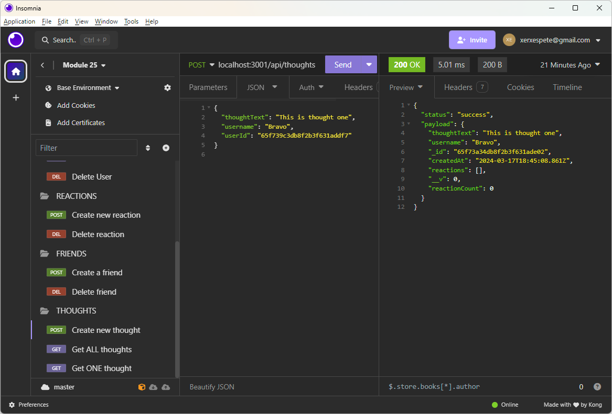

# Social Network 
Unit 18 NoSQL 

## Description

A simple demonstration of using MongoDB databases, collections, documents, and subdocuments.  Allows a user to enter data about themselves, then post "thoughts" that they have, allows different users to become "friends" with other users, and allows users to make "reactions" to users' thoughts.

## Installation

At command line using top-level directory, run the following command

`>npm install`
`>npm start`

## How to Test

Ideally, start with empty database named social_db, or let the job create the database for you.

Use Insomnia or Postman to create new users, create thoughts, reactions, and assign friends.

## Screenshot

## Repository at 
https://github.com/petemaynard/social_network_api

## Link to video demonstration
https://youtu.be/xFqExWbW384

Created by Pete Maynard

